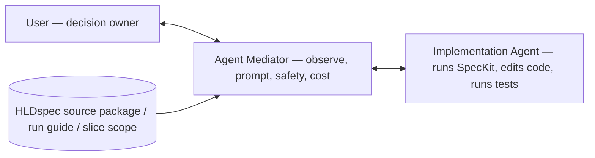

# HLDspec

HLDspec is an agent-first control layer for turning a full HLD into a safe, traceable SpecKit execution workflow.

It does not replace SpecKit. It prepares product truth, validates evidence, gates decisions, and tells SpecKit or a build agent exactly what to do next, what to read, what not to touch, what tests to run, and when to stop.

## The problem HLDspec solves

Large HLDs are too dense for one-shot implementation. If an agent slices the HLD manually, it can lose requirements, invent missing product truth, duplicate logic across layers, or implement too much at once.

HLDspec solves this by keeping the full HLD intact while bounding execution:

```text
One complete HLD
One HLDspec source package
One SpecKit workspace
One complete specify -> plan -> tasks -> analyze flow
Many approved implementation slices
```

The HLD remains the source of truth. The implementation is sliced, not the truth.

## What HLDspec is

HLDspec is:

- a source-truth preparation system for HLD-driven projects
- a target-workspace controller
- a gate and review system
- a SpecKit handoff generator
- a bounded-agent orchestration model
- a traceability and reassessment loop

HLDspec is not:

- a replacement for SpecKit
- a tool for hand-writing final SpecKit specs
- an implementation agent
- a silent product-decision owner
- a system that splits product truth into partial specs by default

## Three user journeys

HLDspec is one workflow with three entry points. They are not equal: **SpecKit
Preparation is the core** — the other two are the bookends around it.

### 1. HLD Authoring — *precondition*

You do not yet have a reliable HLD. HLDspec helps interview, shape, repair, and
clarify the source material until it can become a dependable source-of-truth
document. This is the front-end helper, not the main event.

### 2. SpecKit Preparation — *the core product*

You have an HLD and want it to become **SpecKit-ready**. This is where HLDspec's
job is essentially done. HLDspec:

- preserves the full HLD (never splits product truth to make smaller specs),
- anchors it with stable markers (`HLD-001`, …),
- builds a single source package,
- mirrors read-only context into `.specify/source/`,
- initializes or validates a **real** SpecKit workspace,
- and gives SpecKit the prepared context and answers to run one complete
  `specify -> plan -> tasks -> analyze` flow with good software principles and
  healthy, tested output.

The finish line is a high-quality, anchored, answer-prepared package so the
SpecKit process simply goes well.

### 3. Implementation Guidance — *extension*

After SpecKit outputs exist, things can still go wrong, and you need to drive
implementation to *proper* completion. **HLDspec does not implement the product
itself** — it provides guidance: slice scope, prompts, clarification rules, test
requirements, stop conditions, and reassessment.

Three modes:

- **Manual** — you implement using HLDspec slice scope and checklists.
- **Agent-assisted** — an Implementation Agent receives bounded prompts and scope.
- **Mediator-assisted** — an **Agent Mediator** works alongside you and watches
  the Implementation Agent.



The **Agent Mediator is not the implementing agent.** It is your eyes, ears,
memory, prompt engineer, and safety assistant for an active implementation
session: it watches the session (usually via tmux), reads the HLDspec source
package / run guide / slice scope, detects drift or blockers, prepares better
prompts, and helps you decide when to **go, stop, clarify, rerun tests, or
reassess with HLDspec**. On Devin it bakes complete prompts to spend paid turns
efficiently; on Codex or Claude it acts as an interactive consultant you can ask
"what's known" and request better prompts from.

Mediator boundary — the mediator must not become the source of truth, must not
silently answer human-owned decisions, must not approve completion alone, must
not let the Implementation Agent expand scope, and must not hide failed tests.
Tmux/session state is visibility only, never approval state.

## Core ownership model

| Owner | Owns |
|---|---|
| User (decision owner) | Intent, product/architecture decisions, source-of-truth changes, risky approvals |
| HLDspec | Source-truth/process/gate system: HLD source package, gates, validation, prompts, run cards, reassessment |
| Agent Mediator | User-side observer and prompt/control assistant during an implementation session |
| Implementation Agent | The hands: runs SpecKit, edits code, runs tests — only within bounded run card or slice scope |
| SpecKit | Constitution, final spec, plan, tasks, implementation artifacts |

HLDspec can prepare and constrain work. The user or Agent Mediator enforces
implementation boundaries during the live implementation session. HLDspec cannot
silently approve human-owned decisions.

## Target workspace layout

A target workspace has two important areas:

```text
target/
  .hldspec/
    source_package/
      HLD.md
      HLD.marked.md
      hld_reference_map.json
      speckit_single_spec_input.md
      implementation_slicing_policy.md
      implementation_slices.json
      slice_test_policy.md
      speckit_slice_execution_prompt.md
      anchor_coverage_schema.json
      source_manifest.json
      source_package.json
      session_plan.json
      speckit_runbook.md

  .specify/
    source/
      generated read-only mirror of selected .hldspec/source_package files
    memory/
      constitution.md       # SpecKit-owned when initialized

  specs/
    ...                     # SpecKit-owned final spec artifacts
```

Rules:

- `.hldspec/source_package/` is the HLDspec source package.
- `.specify/source/` is a generated read-only mirror for SpecKit context.
- `.specify/memory/` and `specs/` are SpecKit-owned.
- Source HLD evidence is preserved; HLDspec works from controlled workspace copies.

## Conceptual flow

```mermaid
flowchart TD
    A[Human intent + source HLD] --> B[HLDspec start]
    B --> C[Capture source truth]
    C --> D[Build .hldspec/source_package]
    D --> E[Mirror read-only context to .specify/source]
    E --> F[Initialize or validate SpecKit workspace]
    F --> G[/speckit.specify once]
    G --> H[/speckit.plan once]
    H --> I[/speckit.tasks once]
    I --> J[/speckit.analyze once]
    J --> K{Implementation approved?}
    K -- no --> L[Stop for review or human decision]
    K -- yes --> M[Select implementation slice + task IDs]
    M --> N[Run bounded implementation pass]
    N --> O[Run focused tests + prior regression]
    O --> P[Write phase report + anchor coverage]
    P --> Q[HLDspec reassessment]
    Q --> R{More approved slices?}
    R -- yes --> M
    R -- no --> S[Final hardening or release gate]
```

## Process in plain language

1. The user provides a full HLD and a target workspace.
2. HLDspec copies and normalizes the HLD into controlled workspace evidence.
3. HLDspec marks HLD sections with stable anchors such as `HLD-001`.
4. HLDspec builds a source package and a single SpecKit input from the full HLD.
5. HLDspec mirrors read-only source context into `.specify/source/`.
6. SpecKit creates the full product spec, plan, task graph, and analysis.
7. HLDspec guidance does not allow raw all-task implementation by default.
8. The user or Agent Mediator selects one approved implementation slice and task list from HLDspec guidance.
9. The build agent is instructed to implement only that selected slice.
10. The build agent runs focused tests and prior-slice regression.
11. The build agent reports back with changed files, test evidence, anchor coverage, and blockers.
12. HLDspec reassesses and decides the next safe action.

## Slice-controlled implementation

HLDspec keeps one complete HLD and one complete SpecKit task graph. It bounds
implementation through named slices; the user or Agent Mediator enforces those
bounds while the implementation agent works.

Canonical slices:

| Slice | Purpose | Typical validation |
|---|---|---|
| FOUNDATION | Workspace, scaffold, build/test commands, SpecKit init validation | build/test command exists and runs |
| WALKING_SKELETON | Minimal runnable path with placeholders | app starts, one smoke path works |
| DOMAIN_MODEL | Entities, value objects, statuses, invariants | pure domain unit tests and invalid-state tests |
| CONTRACTS | Ports, DTOs, schemas, event/API contracts | schema/DTO/port contract tests |
| BUSINESS_LOGIC | Use cases, workflows, validation rules | focused use-case and error-path tests |
| PERSISTENCE | DB schema, migrations, repositories | migration, round-trip, transaction tests |
| API | HTTP/RPC routes, controllers, request/response mapping | route, status, auth, error mapping tests |
| CLI | Commands, args, flags, output, exit codes | command parsing and CLI integration tests |
| UI | Screens, components, forms, user journeys | component, form, accessibility, E2E tests |
| INTEGRATION_HARDENING | End-to-end, security, performance, docs, release checks | full regression and release smoke |

Each implementation pass must name:

- selected slice
- allowed task IDs
- HLD anchors in scope
- deferred anchors
- allowed files
- forbidden files
- focused tests
- prior-slice regression tests
- stop condition

A slice is not complete because files changed. It is complete only when tests pass, anchor coverage is updated, and the phase report is written.

See `docs/SPECKIT_SLICE_CONTROL.md` for the technical contract.

## Gates and stop conditions

HLDspec blocks continuation when required evidence is missing, validation fails, anchors are stale, unsupported claims appear, RunSkeptic returns ACTION or CONFLICT, consultant review is missing, or human approval is required.

Agents must stop when:

- they need to make a source-of-truth decision
- they need to answer a human-owned architecture/product question
- selected slice or task IDs are unclear
- they must touch forbidden files
- tests fail
- a required HLD anchor is missing
- implementation would add uncited product behavior
- they cannot prove the next action is safe

## Main user workflow

The public facade is intentionally small:

```bash
python3 scripts/hldspec_agent_session.py start --source /path/to/HLD.md --target /path/to/target
python3 scripts/hldspec_agent_session.py status --target /path/to/target
python3 scripts/hldspec_agent_session.py review --target /path/to/target
python3 scripts/hldspec_agent_session.py continue --target /path/to/target
python3 scripts/hldspec_agent_session.py doctor --target /path/to/target
```

Agents should prefer the facade over low-level scripts unless debugging a failure.


## Production smoke

HLDspec includes a deterministic smoke scenario for the current product path. It is not a real product implementation test. It proves that a tiny HLD can be copied into a temp target, turned into a source package, mirrored into `.specify/source/`, checked for anchors and SpecKit input citations, and reported with an exact PASS/FAIL result.

```bash
python3 scripts/hldspec_smoke_slice_e2e.py --keep
python3 scripts/hldspec_smoke_slice_e2e.py --json --keep
python3 scripts/hldspec_smoke_slice_e2e.py --tmux --keep
```

The smoke destination is always a temp target directory such as:

```text
/tmp/hldspec-smoke-XXXXXX/target
```

Smoke output must never write generated target artifacts into the HLDspec repo. See `docs/SMOKE_SCENARIOS.md`.

## Development and handoff discipline

Local repo state is authoritative. GitHub is only the sync target. Do not push unless explicitly instructed.

Before patching:

```text
git status --short
inspect dirty files
inspect related code
inspect related tests
define behavior changed
define files expected to change
```

After patching:

```text
py_compile changed Python
focused tests
related regression tests
full tests_v2
generated-output smoke, if generated files changed
git diff --check
git status --short
```

Use `docs/HLDSPEC_GAP_HANDOFF_TEMPLATE.md` when handing work to another agent or session.

## Documentation map

| File | Purpose |
|---|---|
| `AGENTS.md` | Agent bootstrap and hard rules |
| `docs/HLDSPEC_TERMINOLOGY_AND_FLOW.md` | Canonical architecture and terminology |
| `docs/SPECKIT_PROXY_PROTOCOL.md` | HLDspec to SpecKit handoff protocol |
| `docs/SPECKIT_SLICE_CONTROL.md` | Technical slice-controlled implementation model |
| `docs/HLDSPEC_GAP_HANDOFF_TEMPLATE.md` | Standard handoff template for current gaps/status |
| `docs/DOCS_INDEX.md` | Full doc index and active/archive map |
| `docs/HLDSPEC_DEVELOPMENT_HANDOFF.md` | Durable repo-development handoff protocol |
| `docs/HLDSPEC_DEVELOPMENT_BACKLOG.md` | Durable backlog of unfinished work |
| `docs/TEST_STRATEGY_V2.md` | Test strategy and conventions |
| `docs/SMOKE_SCENARIOS.md` | Deterministic end-to-end smoke scenarios: what each script validates, usage, and output contract |

## Artifact contract style

HLDspec handoffs, prompts, phase reports, gap handoffs, and slice execution
instructions are written as interface contracts. Each operational artifact should
make the same shape explicit: inputs, authority, allowed actions, forbidden
actions, expected outputs, validation, stop conditions, report format, next
owner, and evidence.

This keeps agent work bounded and resumable. It also prevents hidden scope
expansion: a receiving agent can see what it may read, what it may change, what
is forbidden, what proves success, when it must stop, and who owns the next
decision.

See [HLDspec Artifact Contract Style](docs/HLDSPEC_ARTIFACT_CONTRACT_STYLE.md).
