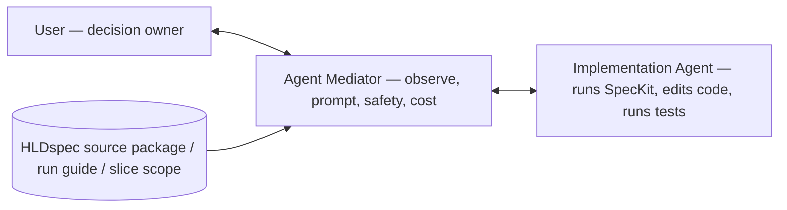

# HLDspec

HLDspec is an agent-first control layer for turning a full HLD into a safe, traceable SpecKit execution workflow.

It does not replace SpecKit. It prepares product truth, validates evidence, gates decisions, and tells SpecKit or a build agent exactly what to do next, what to read, what not to touch, what tests to run, and when to stop.

## The problem HLDspec solves

Large HLDs are too dense for one-shot implementation. If an agent slices the HLD manually, it can lose requirements, invent missing product truth, duplicate logic across layers, or implement too much at once.

HLDspec solves this by keeping the full HLD intact while bounding execution:

```text
One complete HLD
One HLDspec source package
One SpecKit workspace
One complete specify -> plan -> tasks -> analyze flow
Many approved implementation slices
```

The HLD remains the source of truth. The implementation is sliced, not the truth.

## What HLDspec is

HLDspec is:

- a source-truth preparation system for HLD-driven projects
- a target-workspace controller
- a gate and review system
- a SpecKit handoff generator
- a bounded-agent orchestration model
- a traceability and reassessment loop

HLDspec is not:

- a replacement for SpecKit
- a tool for hand-writing final SpecKit specs
- an implementation agent
- a silent product-decision owner
- a system that splits product truth into partial specs by default

## Three user journeys

HLDspec is one workflow with three entry points. They are not equal: **SpecKit
Preparation is the core** — the other two are the bookends around it.

### 1. HLD Authoring — *precondition*

You do not yet have a reliable HLD. HLDspec helps interview, shape, repair, and
clarify the source material until it can become a dependable source-of-truth
document. This is the front-end helper, not the main event.

### 2. SpecKit Preparation — *the core product*

You have an HLD and want it to become **SpecKit-ready**. This is where HLDspec's
job is essentially done. HLDspec:

- preserves the full HLD (never splits product truth to make smaller specs),
- anchors it with stable markers (`HLD-001`, …),
- builds a single source package,
- records SpecKit install/init readiness,
- initializes or validates a **real** SpecKit workspace only at the execution boundary,
- mirrors read-only context into `.specify/source/` only after real SpecKit init validates,
- and prepares the context and answers for one complete
  `specify -> plan -> tasks -> analyze` flow with good software principles and
  healthy, tested output.

The finish line is a high-quality, anchored, answer-prepared package so the
SpecKit process simply goes well.

### 3. Implementation Guidance — *extension*

After SpecKit outputs exist, things can still go wrong, and you need to drive
implementation to *proper* completion. **HLDspec does not implement the product
itself** — it provides guidance: slice scope, prompts, clarification rules, test
requirements, stop conditions, and reassessment.

Greenfield-first MVP: the supported path is `HLD -> HLDspec source package -> SpecKit preparation -> implementation slicing -> mediator guidance`. Existing-product change mode is future scope unless a later patch explicitly documents it.

Three modes:

- **Manual** — you implement using HLDspec slice scope and checklists.
- **Agent-assisted** — an Implementation Agent receives bounded prompts and scope.
- **Mediator-assisted** — an **Agent Mediator** works alongside you and watches
  the Implementation Agent.



The **Agent Mediator is not the implementing agent.** It is your eyes, ears,
memory, prompt engineer, and safety assistant for an active implementation
session: it watches the session (usually via tmux), reads the HLDspec source
package / run guide / slice scope, detects drift or blockers, prepares better
prompts, and helps you decide when to **go, stop, clarify, rerun tests, or
reassess with HLDspec**. On Devin it bakes complete prompts to spend paid turns
efficiently; on Codex or Claude it acts as an interactive consultant you can ask
"what's known" and request better prompts from.

Mediator boundary — the mediator must not become the source of truth, must not
silently answer human-owned decisions, must not approve completion alone, must
not let the Implementation Agent expand scope, and must not hide failed tests.
Tmux/session state is visibility only, never approval state.

Operator / Doctor / Devin Mediator boundary — HLDspec Operator is the core
layer that today uses target facts, source-package state, Engineering Toolbox
guidance, implementation slicing, mediator/operator guidance, and SpecKit
Doctor readiness facts. Its Operator State for the readiness boundary is
implemented; broader post-specify lifecycle state and richer next-safe-action
guidance remain planned. SpecKit Doctor is the diagnostic/preflight part of the
Operator, not the whole Operator. Devin Mediator is Devin-specific adapter
behavior that consumes HLDspec Operator facts/artifacts to drive Devin safely;
HLDspec does not mediate Devin directly, and Devin exact go/stop/tmux/session
rules do not define the generic Operator layer.

## Core ownership model

| Owner | Owns |
|---|---|
| User (decision owner) | Intent, product/architecture decisions, source-of-truth changes, risky approvals |
| HLDspec | Source-truth/process/gate system: HLD source package, gates, validation, prompts, run cards, reassessment |
| Agent Mediator | User-side observer and prompt/control assistant during an implementation session |
| Implementation Agent | The hands: runs SpecKit, edits code, runs tests — only within bounded run card or slice scope |
| SpecKit | Constitution, final spec, plan, tasks, implementation artifacts |

HLDspec can prepare and constrain work. The user or Agent Mediator enforces
implementation boundaries during the live implementation session. HLDspec cannot
silently approve human-owned decisions.

## Target workspace layout

A target workspace has two important areas:

```text
target/
  .hldspec/
    source_package/
      HLD.md
      HLD.marked.md
      hld_reference_map.json
      speckit_single_spec_input.md
      implementation_slicing_policy.md
      implementation_slices.json
      slice_test_policy.md
      speckit_slice_execution_prompt.md
      anchor_coverage_schema.json
      source_manifest.json
      source_package.json
      session_plan.json
      speckit_runbook.md

  .specify/
    source/
      generated read-only mirror of selected .hldspec/source_package files
    memory/
      constitution.md       # SpecKit-owned when initialized

  specs/
    ...                     # SpecKit-owned final spec artifacts
```

Rules:

- `.hldspec/source_package/` is the HLDspec source package.
- `.specify/source/` is a generated read-only mirror for SpecKit context.
- `.specify/memory/` and `specs/` are SpecKit-owned.
- Source HLD evidence is preserved; HLDspec works from controlled workspace copies.

## Conceptual flow

```mermaid
flowchart TD
    A[Human intent + source HLD] --> B[HLDspec start]
    B --> C[Capture source truth]
    C --> D[Build .hldspec/source_package]
    D --> E[Check SpecKit install + git branch readiness]
    E --> F[Initialize or validate real SpecKit workspace]
    F --> G[Mirror read-only context to .specify/source]
    G --> H[/speckit.specify once]
    H --> I[/speckit.plan once]
    I --> J[/speckit.tasks once]
    J --> K[/speckit.analyze once]
    K --> L{Implementation approved?}
    L -- no --> M[Stop for review or human decision]
    L -- yes --> N[Select implementation slice + task IDs]
    N --> O[Run bounded implementation pass]
    O --> P[Run focused tests + prior regression]
    P --> Q[Write phase report + anchor coverage]
    Q --> R[HLDspec reassessment]
    R --> S{More approved slices?}
    S -- yes --> N
    S -- no --> T[Final hardening or release gate]
```

## Process in plain language

1. The user provides a full HLD and a target workspace.
2. HLDspec copies and normalizes the HLD into controlled workspace evidence.
3. HLDspec marks HLD sections with stable anchors such as `HLD-001`.
4. HLDspec builds a source package and a single SpecKit input from the full HLD.
5. HLDspec checks SpecKit install/init readiness plus git branch readiness.
6. Real SpecKit init creates or validates `.specify/memory/`.
7. HLDspec mirrors read-only source context into `.specify/source/` after init validates.
8. SpecKit creates the full product spec, plan, task graph, and analysis.
9. HLDspec guidance does not allow raw all-task implementation by default.
10. The user or Agent Mediator selects one approved implementation slice and task list from HLDspec guidance.
11. The build agent is instructed to implement only that selected slice.
12. The build agent runs focused tests and prior-slice regression.
13. The build agent reports back with changed files, test evidence, anchor coverage, and blockers.
14. HLDspec reassesses and decides the next safe action.

## Slice-controlled implementation

HLDspec keeps one complete HLD and one complete SpecKit task graph. It bounds
implementation through named slices; the user or Agent Mediator enforces those
bounds while the implementation agent works.

Canonical slices:

| Slice | Purpose | Typical validation |
|---|---|---|
| FOUNDATION | Workspace, scaffold, build/test commands, SpecKit init validation | build/test command exists and runs |
| WALKING_SKELETON | Minimal runnable path with placeholders | app starts, one smoke path works |
| DOMAIN_MODEL | Entities, value objects, statuses, invariants | pure domain unit tests and invalid-state tests |
| CONTRACTS | Ports, DTOs, schemas, event/API contracts | schema/DTO/port contract tests |
| BUSINESS_LOGIC | Use cases, workflows, validation rules | focused use-case and error-path tests |
| PERSISTENCE | DB schema, migrations, repositories | migration, round-trip, transaction tests |
| API | HTTP/RPC routes, controllers, request/response mapping | route, status, auth, error mapping tests |
| CLI | Commands, args, flags, output, exit codes | command parsing and CLI integration tests |
| UI | Screens, components, forms, user journeys | component, form, accessibility, E2E tests |
| INTEGRATION_HARDENING | End-to-end, security, performance, docs, release checks | full regression and release smoke |

Each implementation pass must name:

- selected slice
- allowed task IDs
- HLD anchors in scope
- deferred anchors
- allowed files
- forbidden files
- focused tests
- prior-slice regression tests
- stop condition

A slice is not complete because files changed. It is complete only when tests pass, anchor coverage is updated, and the phase report is written.

See `docs/SPECKIT_SLICE_CONTROL.md` for the technical contract.

## Gates and stop conditions

HLDspec blocks continuation when required evidence is missing, validation fails, anchors are stale, unsupported claims appear, RunSkeptic returns ACTION or CONFLICT, consultant review is missing, or human approval is required.

Agents must stop when:

- they need to make a source-of-truth decision
- they need to answer a human-owned architecture/product question
- selected slice or task IDs are unclear
- they must touch forbidden files
- tests fail
- a required HLD anchor is missing
- implementation would add uncited product behavior
- they cannot prove the next action is safe

## Main user workflow

The normal way to use HLDspec is **agent-first**: you give an agent a single
one-line instruction, and the agent uses HLDspec's internal tools to prepare the
target and report back. You do **not** normally run any script path yourself.

What you do:

- Give an agent one short HLDspec instruction (below).
- The agent uses HLDspec's internal tools to prepare the target workspace and
  check SpecKit readiness.
- The agent reports **STATUS, blockers, evidence, and the next safe action**.
- You stay the decision owner; HLDspec never runs SpecKit or implements code
  until it reports that doing so is safe.

Copy-ready instruction to give the agent:

```text
Use HLDspec with source HLD: <path-to-HLD.md> and target project: <path-to-target>. Prepare the target, check SpecKit readiness, and report STATUS, blockers, evidence, and next safe action. Do not implement or run SpecKit unless HLDspec says it is safe.
```

A normal user does not need to know any script path: the agent runs HLDspec's
internal command surface and reports the results back to you.

### Internal command/tool surface (what the agent may run)

The commands below are **internal/manual tooling** — what the agent runs on your
behalf, and what maintainers use for debug/fallback. They are **not** the normal
user entry point; the agent one-liner above is. `scripts/hldspec_agent_session.py`
is HLDspec's internal command surface, not the public product interface, so a
normal user should not need to invoke it directly.

```bash
# Prepare or resume a target workspace from an HLD
python3 scripts/hldspec_agent_session.py start --source /path/to/HLD.md --target /path/to/target

# Report current state and the next safe action
python3 scripts/hldspec_agent_session.py operator-state --target /path/to/target
```

The full internal command/tool surface the agent may run:

| Command | What it does |
|---|---|
| `start` | Prepare or resume a session: copy the HLD into the target, build the source package, record SpecKit init readiness, and mirror read-only context only when a real SpecKit workspace already validates. |
| `status` | Show session status, blockers, open questions, and the next safe action. |
| `review` | List the human review files and which blocking ones are missing. |
| `continue` | Run the pipeline to the next safe checkpoint (gated). |
| `diff` | Compare the source HLD hash to the recorded session hash. |
| `doctor` | Check agent-first docs and target session/layout files. |
| `speckit-doctor` | Readiness/preflight only: is the target ready for real SpecKit work? Does not decide the lifecycle. |
| `operator-state` (alias `speckit-state`) | Report the readiness-boundary Operator State and the evidence-backed next safe action. Consumes `speckit-doctor` facts; it does **not** replace the doctor. |

`operator-state` / `speckit-state` are scoped to the **readiness boundary**
today; broader post-specify lifecycle Operator State remains planned.

The canonical command list is maintained in
[`docs/HLDSPEC_TERMINOLOGY_AND_FLOW.md`](docs/HLDSPEC_TERMINOLOGY_AND_FLOW.md)
(HLDspec Product Facade / runtime command surface); this table presents the same
set. It is a command/tool surface, not the primary human UX.

Agents run this command surface on the user's behalf and should prefer it over
low-level scripts; a normal user does not invoke it directly.

### Reading results: PASS / ACTION / CONFLICT

`status`, `doctor`, `speckit-doctor`, and `operator-state` report one decision
word so you always know whether it is safe to proceed:

| Result | Meaning | What to do |
|---|---|---|
| `PASS` | No blockers at this boundary. | Proceed with the printed next safe action. |
| `ACTION` | Something is missing or not ready. | Do the printed next safe action, then rerun. |
| `CONFLICT` | Evidence disagrees or a human-owned decision is required. | Stop; resolve the conflict / make the decision, then rerun. |

Every result prints an explicit **next safe action** and exits non-zero on
`ACTION`/`CONFLICT`, so failure messages always tell you what to do next.

For where this sits against full product readiness (and what is **not** yet
production-ready), see [`docs/PRODUCT_READINESS.md`](docs/PRODUCT_READINESS.md).
For a map of the repository itself, see [`docs/REPO_LAYOUT.md`](docs/REPO_LAYOUT.md).


## Production smoke

HLDspec includes a deterministic smoke scenario for the current source-package/mirror path. It is not a real product implementation test and it is not proof of real SpecKit init. It proves that a tiny HLD can be copied into a temp target, turned into a source package, mirrored into `.specify/source/` for controlled validation, checked for anchors and SpecKit input citations, and reported with an exact PASS/FAIL result.

```bash
python3 scripts/hldspec_smoke_slice_e2e.py --keep
python3 scripts/hldspec_smoke_slice_e2e.py --json --keep
python3 scripts/hldspec_smoke_slice_e2e.py --tmux --keep
```

The smoke destination is always a temp target directory such as:

```text
/tmp/hldspec-smoke-XXXXXX/target
```

Smoke output must never write generated target artifacts into the HLDspec repo. See `docs/SMOKE_SCENARIOS.md`.

## One-command validation

To validate the repo without knowing its history, run:

```bash
scripts/check_product_readiness.sh
```

It runs syntax checks, the focused readiness/operator/anti-drift/terminology and
product-readiness/layout tests, the full `tests_v2` suite, the smoke, and a
whitespace check, and prints `PRODUCT_READINESS_CHECK: PASS` only if all pass. It
is a local check, not CI or a release gate — see `docs/PRODUCT_READINESS.md`.

## Development and handoff discipline

Local repo state is authoritative. GitHub is only the sync target. Do not push unless explicitly instructed.

Before patching:

```text
git status --short
inspect dirty files
inspect related code
inspect related tests
define behavior changed
define files expected to change
```

After patching:

```text
py_compile changed Python
focused tests
related regression tests
full tests_v2
generated-output smoke, if generated files changed
git diff --check
git status --short
```

Use `docs/HLDSPEC_GAP_HANDOFF_TEMPLATE.md` when handing work to another agent or session.

## Documentation map

| File | Purpose |
|---|---|
| `AGENTS.md` | Agent bootstrap and hard rules |
| `docs/HLDSPEC_TERMINOLOGY_AND_FLOW.md` | Canonical architecture and terminology |
| `docs/SPECKIT_PROXY_PROTOCOL.md` | HLDspec to SpecKit handoff protocol |
| `docs/SPECKIT_SLICE_CONTROL.md` | Technical slice-controlled implementation model |
| `docs/HLDSPEC_GAP_HANDOFF_TEMPLATE.md` | Standard handoff template for current gaps/status |
| `docs/DOCS_INDEX.md` | Full doc index and active/archive map |
| `docs/HLDSPEC_DEVELOPMENT_HANDOFF.md` | Durable repo-development handoff protocol |
| `docs/HLDSPEC_DEVELOPMENT_BACKLOG.md` | Durable backlog of unfinished work |
| `docs/TEST_STRATEGY_V2.md` | Test strategy and conventions |
| `docs/SMOKE_SCENARIOS.md` | Deterministic end-to-end smoke scenarios: what each script validates, usage, and output contract |

## Artifact contract style

HLDspec handoffs, prompts, phase reports, gap handoffs, and slice execution
instructions are written as interface contracts. Each operational artifact should
make the same shape explicit: inputs, authority, allowed actions, forbidden
actions, expected outputs, validation, stop conditions, report format, next
owner, and evidence.

This keeps agent work bounded and resumable. It also prevents hidden scope
expansion: a receiving agent can see what it may read, what it may change, what
is forbidden, what proves success, when it must stop, and who owns the next
decision.

See [HLDspec Artifact Contract Style](docs/HLDSPEC_ARTIFACT_CONTRACT_STYLE.md).
